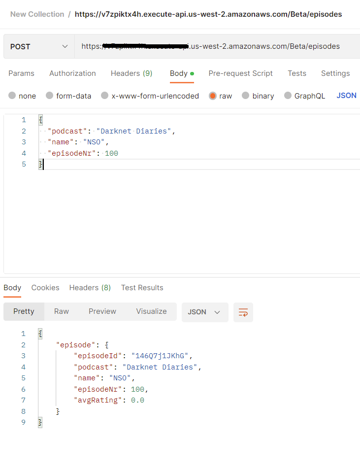
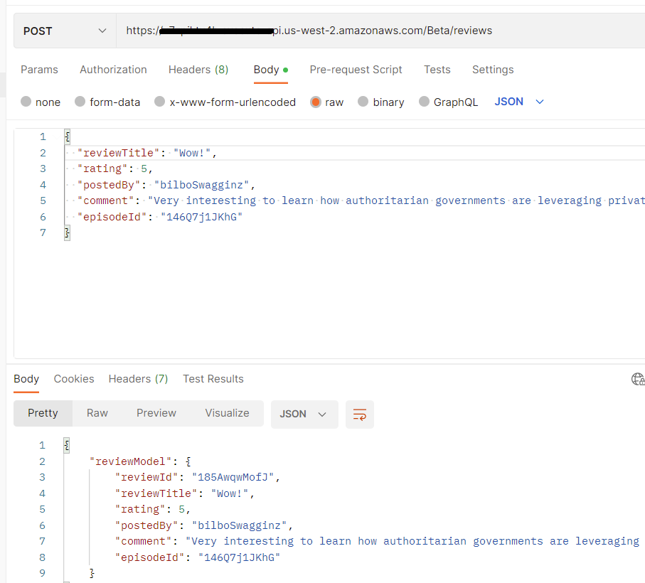

# Podcast Episode & Review Data API

AWS based API backend for uploading episodes and reviews for podcasts. The Activity classes are the lambda functions that handle the requests between DynamoDB and API Gateway.

## Set-up
0 - Make sure you AWS credentials are set up and working .

1 - Create the tables:

Run the following commands to use the yaml that are in the cloudformation folder files to create the tables in DynamoDB.

Change ```--region``` if needed.
```
aws cloudformation create-stack --region us-west-2 --stack-name dynamodbtabledesign-episodestable01 --template-body file://project_documents/cloudformation/episodes_table.yaml --capabilities CAPABILITY_IAM
```

```
aws cloudformation create-stack --region us-west-2 --stack-name dynamodbtabledesign-reviewsstable01 --template-body file://project_documents/cloudformation/reviews_table.yaml --capabilities CAPABILITY_IAM
```

2 - Create the Lambda functions:
- For each Activity class (there are 5 total) you will have to:
1. In AWS Lambda click on "create function"
2. Name the function. It makes sense to name it after the classes name.
3. Choose Java 11 for Runtime. Leave the other settings as they are.
4. Once the function is created use the "Upload from " option to upload a zipped distribution of the sources code. This can be done within the build.gradle file by running the buildZip task.
5. In the Configuration > Permission tab/menu click on the role name to open the role for the function. This is where you configure access by the function to DynamoDB. Refer to [this](https://www.youtube.com/watch?v=f7o8RV3Edck&t=753s) video for how to adjust permissions as needed.

3 - Create and set up the API gateway.
1. In AWS API Gateway click on "Create API". Choose the REST API option.
2. In the Create new API section, select "Import from Swagger or Open API 3". Now you can either upload the project_documents/api_design/openapi.yaml file 
or copy/paste it in there directly.
3. Now you will have to configure each method by selecting the corresponding lambda function. If you are unsure which api endpoints correspond to each lambda function check the design document.
4. Proxy Integration requests will not work since the lambda functions are not set up for that.
5. Test the methods to make sure they are working correctly before you move on.
6. If you want to set up API keys check out [this](https://docs.aws.amazon.com/apigateway/latest/developerguide/api-gateway-api-usage-plans.html) and [this](https://docs.aws.amazon.com/apigateway/latest/developerguide/api-gateway-setup-api-key-with-console.html) documentation.
## Usage
Once set up and tested, you can interact with the API endpoints with HTTP request. Here are a few examples of
the API in action using Postman:





## Open Issues
1. GetTopRated request is not WAI
2. openapi.yaml file need to be updated to reflect the get episode endpoints
3. Increase test coverage to at least %80
## Contributing

Pull requests are welcome. For major changes, please open an issue first
to discuss what you would like to change.

Please make sure to update tests as appropriate.
