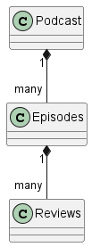
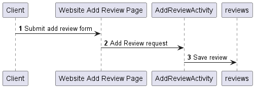
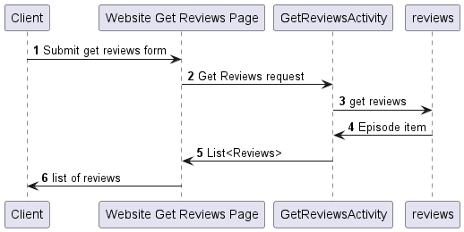
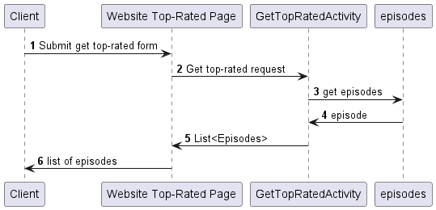

# NoobzPodcastReviewService Design Document

## Podcast Review Service Design


## 1. Problem Statement

Our service aims to provide a platform for users to discover and engage with podcast episodes by allowing them to leave
reviews and ratings for episodes.
The problem we aim to solve is the lack of a centralized and user-friendly platform for discovering and reviewing
podcast episodes, making it difficult for users to find high-quality content and for podcast creators to gain valuable
feedback on their episodes.

## 2. Top Questions to Resolve in Review

1. Will we implement a subscription service?
2. How will users browse through reviews?
3. How will we make sure there are no duplicate Podcast episodes entries?
4. How will users add episodes that don't exist?

## 3. Use Cases

U1. As a customer, I want to get ratings for podcast episodes when I look up a specific podcast.

U2. As a customer, I want to look through the top-rated episodes for all podcast.

U3. As a customer, I want to get the average rating for a given podcast.

U4. As a customer, I want to review a podcast episode.

U5. AS a customer, I want to see all reviews for a given episode.

## 4. Project Scope

### 4.1. In Scope

* Adding podcast episodes with a review
* Reviewing existing episodes with comments and rating
* Allowing users to sign-up

### 4.2. Out of Scope

* Create a database with all podcast episodes
* Editing existing reviews
* Playback of episodes
* Implementing genres and searching by genre

# 5. Proposed Architecture Overview

The initial iteration will provide the minimum lovable product (MLP) including adding episodes with comments and
ratings,
browsing of top-rated podcasts episodes and a simple sign-up form.

Class Diagram: (Podcast Object will not be implemented. It will be a String attribute of Episodes)



The API endpoints will be (`CreateReview`, `GetReviews`, `GetTopRated`, `AddEpisode`)

*You should argue why this architecture (organization of components) is
reasonable. That is, why it represents a good data flow and a good separation of
concerns. Where applicable, argue why this architecture satisfies the stated
requirements.*

Episodes, Reviews and Users will be stored in 3 separate tables.
The CreateReview endpoint will check if the episode exists already in DynamoDB and create a new one if it doesn't.
If it does, it will add a review to the Reviews table and associate it with the existing episode.

GetReviews endpoint will call all Reviews for a given Episode.

The GetTopRated endpoints will provide a list of up to 20 top-rated episodes.

AddEpisodes end point will allow users to add episodes to the database

# 6. API

## 6.1. Public Models

```
// EpisodeModel
String podcast;
String name;
Integer episodeNr;
Double avgRating;
List<Reviews>
```

```
// ReviewModel
String reviewId;
String reviewTitle;
Integer rating;
String postedBy;
String comment;
String episodeId;
```

## 6.2. AddReview Endpoint
* Accepts `POST` request to /reviews
* Accepts a review object, with a title, rating, comment, provided episode id and commenters name/username.
  * If the episode is not found it will throw a EpisodeNotFoundException



## 6.3 GetReviews Endpoint
* Accepts a `GET` request to /reviews
* Accepts an episodeID and returns the corresponding EpisodeModel



## 6.3 GetTopRated Endpoint
* Accepts a `GET` request to /episodes
* Returns a List of EpisodeModel



## 6.5 AddEpisode Endpoint
* Accepts a `POST` request
* Accepts an episode object, with  podcast, name, episodeNr

# 7. Tables

*Define the DynamoDB tables you will need for the data your service will use. It
may be helpful to first think of what objects your service will need, then
translate that to a table structure, like with the *`Playlist` POJO* versus the
`playlists` table in the Unit 3 project.*


### 7.1. `episodes`

```
podcast // partition key, string
episodeNr // sort key, number
name // string
episodeId // string
avgRating // number
```

Will implement GSI with avgRating as partition key and episodeId as sort key

### 7.2. `reviews`

```
episodeId // partition key, string
reviewId // sort key, string
title // string
rating // number
postedBy // string
comment // String
```

# 8. Pages


